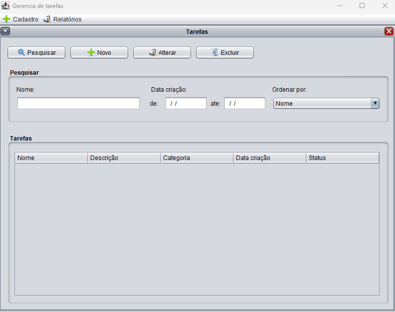
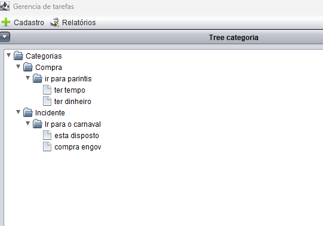

# JTaskManager
Teste prático feito em swing e SQLite

### Para utilizar a aplicação efetuar o clone do projeto

```
$ git clone https://github.com/celiomatos/JTaskManager.git
```

- utilize o eclipse para abrir o projeto jtaskmanager
- execute como um java application
- Classe de execução é a JTaskMananger do pacote br.com.jtaskmananger

- Tela principal da aplicação


- Na opção de menu cadastro > tarefas 
- Você vai encontrar a tela de listagem de tarefas


- Na opção de menu Relatórios
- Voc6e vai encontrar o Tree de Categorias

